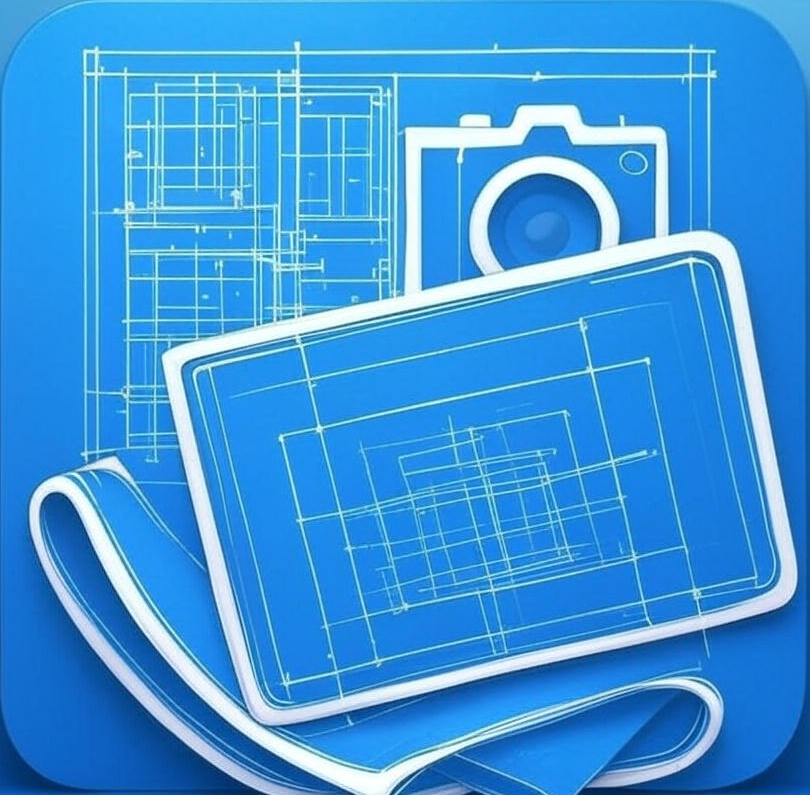

{width=200}

<h1 align="center">Site Companion</h1>

## A companion App that helps users to manage their site observations and reports.

[](https://github.com/Khaled-fayed/SiteCompanion/actions)
[](https://codecov.io/gh/Khaled-fayed/SiteCompanion)
[](https://pub.dev/packages/sitecompanion)
[](https://github.com/Khaled-fayed/SiteCompanion)
[](https://github.com/Khaled-fayed/SiteCompanion/commits/main)
[](https://github.com/Khaled-fayed/SiteCompanion/blob/main/LICENSE)
[](https://docs.flutter.dev/)

## Features

- **Project Management**: Create, view, edit, archive, and delete projects.
- **Observation Tracking**: Record detailed observations, optionally linked to specific projects.
- **Media Integration**: Capture and attach images/videos to observations.
- **Speech-to-Text**: Utilize speech recognition for quick note-taking.
- **Report Generation**: Generate PDF reports from observations.
- **Local Persistence**: Data is stored locally using a `drift` database.
- **Intuitive Navigation**: Easy switching between Home, Projects, and Observations sections via a bottom navigation bar.
- **Theming**: Supports light and dark themes.

## Getting Started

This project is a starting point for a Flutter application.

### Prerequisites

- Flutter SDK installed.
- A code editor like VS Code with the Flutter extension.

### Installation

1. Clone the repository:
   ```bash
   git clone https://your-repository-link.git
   cd sitecompanion
   ```
2. Get dependencies:
   ```bash
   flutter pub get
   ```
3. Run the app:
   ```bash
   flutter run
   ```

## Project Structure

The application follows a clean architecture approach, separating concerns into:

- `lib/app`: Application-level configurations, routing, and theming.
- `lib/core`: Core services (media, speech-to-text, reporting) and utilities.
- `lib/data`: Data layer, including local database (`drift`) and repository implementations.
- `lib/domain`: Domain layer, containing entities and repository interfaces.
- `lib/features`: Feature-specific UI and business logic (e.g., home, projects, observations).
- `lib/widgets`: Reusable UI components.

## Technologies Used

- **Flutter**: UI Toolkit for building natively compiled applications for mobile, web, and desktop from a single codebase.
- **BLoC/Flutter Bloc**: State management.
- **GoRouter**: Declarative routing for Flutter.
- **Drift**: Reactive persistence library for Flutter and Dart, built on SQLite.
- **GetIt**: Simple Service Locator for Dart and Flutter projects.
- **Image Picker & Camera**: For handling media capture.
- **Speech to Text**: For speech recognition capabilities.
- **PDF**: For generating PDF reports.
- **Share Plus**: For sharing content.

## Future Enhancements (TODOs)

- Implement search functionality for projects and observations.
- Develop a "Templates" screen for predefined observation templates.
- Create a "Drafts" screen to manage unsaved observations.
- Further refine UI/UX and add more advanced reporting options.

## Resources

A few resources to get you started if this is your first Flutter project:

- [Lab: Write your first Flutter app](https://docs.flutter.dev/get-started/codelab)
- [Cookbook: Useful Flutter samples](https://docs.flutter.dev/cookbook)

For help getting started with Flutter development, view the
[online documentation](https://docs.flutter.dev/), which offers tutorials,
samples, guidance on mobile development, and a full API reference.
